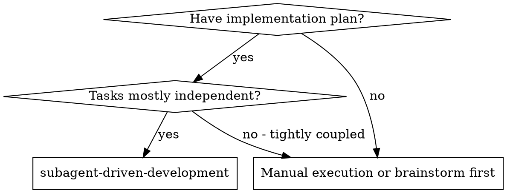
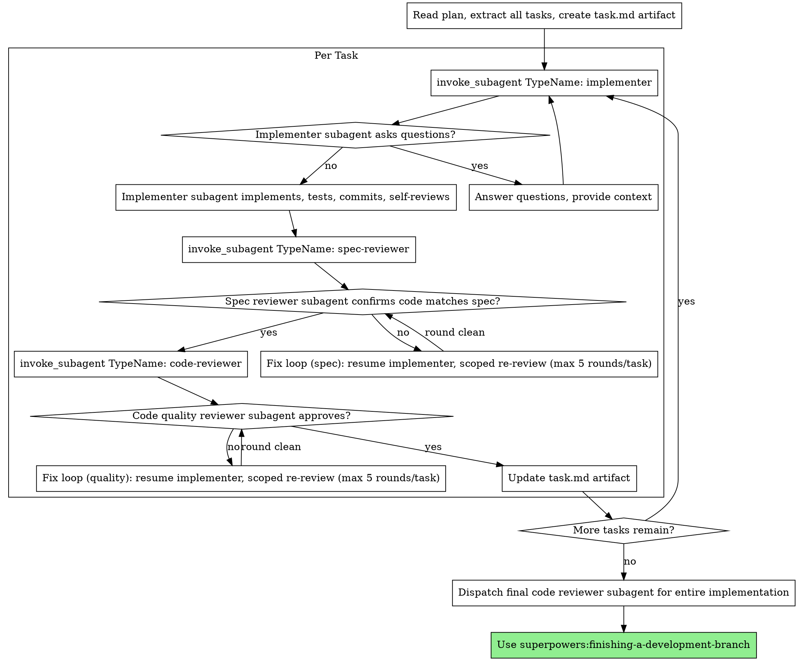
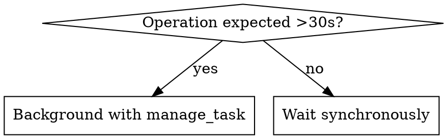
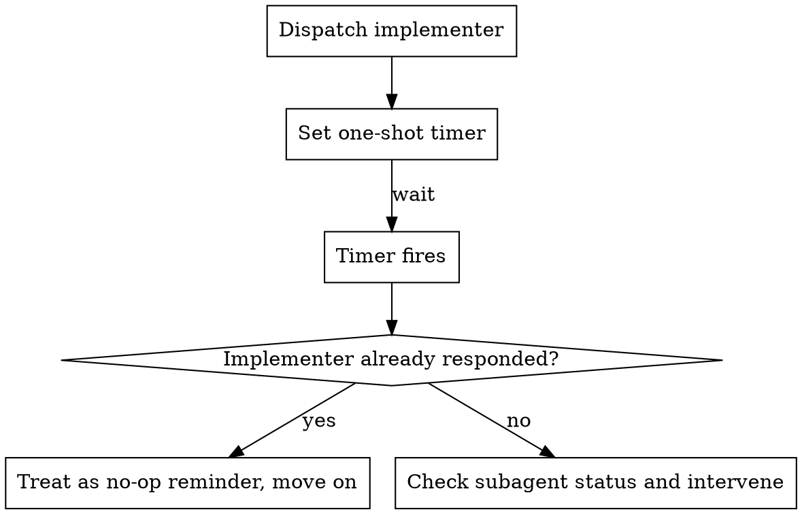

# Subagent-Driven Development

Execute plan by dispatching fresh subagent per task, with two-stage review after each: spec compliance review first, then code quality review.

**Why subagents:** You delegate tasks to specialized agents with isolated context. By precisely crafting their instructions and context, you ensure they stay focused and succeed at their task. They should never inherit your session's context or history — you construct exactly what they need. This also preserves your own context for coordination work.

**Core principle:** Fresh subagent per task + two-stage review (spec then quality) = high quality, fast iteration

**Continuous execution:** Do not pause to check in with your human partner between tasks. Execute all tasks from the plan without stopping. The only reasons to stop are the four named below, or all tasks complete. "Should I continue?" prompts and progress summaries waste their time — they asked you to execute the plan, so execute it.

**Rulings, not stalls.** A running plan does not wait on a human. Conflicts,
ambiguities, plan defects, a cap you would have asked to exceed — decide
them. The spec is the binding authority, the plan is its argument, and your
judgment settles what neither answers. Record every decision in the ledger as
`Ruling: <what you decided> — <why> — <what it costs if wrong>`, and keep
going. A wrong ruling costs rework your human partner can see and undo; a
session parked on a question costs their whole day and buys nothing.

Four things stop you, and only these: an irreversible or destructive
operation; a security-sensitive action; a side effect outside this worktree
that norms say you ask about first (a merge, a push to a shared branch, a
publish); and a plan so broken that every path forward is a guess. For those,
stop and ask.

## When to Use



Plans come from **superpowers:writing-plans**. This skill executes one.

## The Process



## Setup

1. Ensure an isolated workspace: use superpowers:using-git-worktrees to create one or verify the existing one

**Never:**
- Start implementation on main/master branch without explicit user consent

- At skill start, resolve this plan's workspace:
  `<repo-root>/.superpowers/sdd/<plan-basename>/` (plan filename without
  `.md`). Create it and the self-ignore rule in one command:
  `mkdir -p .superpowers/sdd/<plan-basename> && printf '*\n' > .superpowers/.gitignore`

Then open the ledger:

- If `progress.md` exists in this plan's directory, read it — tasks it marks complete are DONE; resume at the first task not marked complete.
- If it does not exist, create it now with its header line: `# SDD ledger — plan: <plan file path>`.

The four roles ship as bundled agents — `implementer`, `spec-reviewer`,
`code-reviewer`, `re-reviewer` (defined in the plugin's `agents/`
directory). No registration step: dispatch them by TypeName. If a dispatch
fails with an unknown TypeName, the plugin's agents are not being
discovered — verify the plugin installation before working around it.

**Workspace isolation per role:**

| Role | Workspace Mode | Why |
|------|---------------|-----|
| Implementer | `Workspace: "branch"` | Needs isolated write access |
| Spec reviewer | `Workspace: "inherit"` | Read-only — only inspects code |
| Code reviewer | `Workspace: "inherit"` | Read-only — only inspects code |
| Re-reviewer | `Workspace: "inherit"` | Read-only — verifies the fix diff |

Read the plan once, extract all tasks with full text and context, and
create a `task.md` artifact tracking each task's status. If the plan names
a Spec, read that too: the spec is the authority the plan argues from, and
conflicts inside the plan resolve against it. A plan with no reachable spec
gets a ledger note saying so — rulings made without one are provisional.

### Pre-Flight Plan Review

Before dispatching Task 1, scan the plan once for conflicts, writing down
what you checked as you check it:

- tasks that contradict each other or the plan's Global Constraints
- anything the plan explicitly mandates that the review rubric treats as a
  defect (a test that asserts nothing, verbatim duplication of a logic block)

The scan's output is a table, not a verdict. One row for every pair of tasks
that share a file or an interface: the two tasks, what one produces against
what the other consumes, and what you found. One row for every task: whether
its own text agrees with itself — the tests it specifies against the code it
specifies, the files it creates against the files it later touches. "The scan
is clean" without those rows is not a scan you ran.

Write the table to the ledger. Rule on everything you find before execution
begins — each finding against the plan text that mandates it — and record
each ruling in the ledger. If the scan is clean, proceed without comment.
Rule on each conflict it surfaces — the spec is the binding authority, the
plan is its argument — record the ruling beside its row, and dispatch
Task 1. The review loop remains the net for conflicts that only emerge from
implementation.

## Model Selection

Model tiers are set in each agent file's frontmatter (`model: flash|pro|inherit`). The four bundled roles live in the plugin's `agents/` directory and all ship `model: inherit` — the session's model governs. To differentiate tiers, add a workspace-scoped variant at `.agents/agents/<name>.md` first — this is the primary escalation path — or edit the plugin's bundled agent files directly; editing plugin (or global) agent files may require the user's Agent Non-Workspace File Access setting to be enabled. Neither `define_subagent` nor `invoke_subagent` takes a model argument.

Use the least powerful tier that can handle each role to conserve cost and increase speed.

**Mechanical implementation tasks** (isolated functions, clear specs, 1-2 files): use a flash-tier agent type. Most implementation tasks are mechanical when the plan is well-specified.

**Integration and judgment tasks** (multi-file coordination, pattern matching, debugging): use a standard model.

**Architecture, design, and review tasks**: use a pro-tier agent type.

**Task complexity signals:**
- Touches 1-2 files with a complete spec → flash-tier agent type
- Touches multiple files with integration concerns → standard model
- Requires design judgment or broad codebase understanding → pro-tier agent type

## The Task Loop

**Batch small same-shape work.** When the plan lists several tasks that are
each a small, independent edit of the same kind — the same one-line fix,
constant change, or field addition repeated across files — do not dispatch
one subagent per task. Compose ONE dispatch brief listing every file and
its change, send the whole batch to a single subagent, and review its diff
as one unit. Reserve one-dispatch-per-task for work that needs its own
judgment, its own tests, or its own review surface.

For each task, in plan order:

1. Fill `implementer-prompt.md`'s dynamic template with the task's full text and scene-setting context, then dispatch: `invoke_subagent(Subagents: [{TypeName: "implementer", Role: "Implement Task <N>", Prompt: <filled template>, Workspace: "branch"}])`.
2. **Record the implementer's conversation ID and its task branch name from the dispatch result** — the fix loop and the ledger's commit range depend on both.
3. When the implementer reports DONE, run the two review stages in order: `spec-reviewer` first, then `code-reviewer` (dispatch templates in Prompt Templates below). Findings from either stage enter The Fix Loop.

**Never:**
- Dispatch multiple implementation subagents in parallel (conflicts)
- Make subagent read plan file (provide full text instead)
- **Start code quality review before spec compliance is ✅** (wrong order)

### Handling Implementer Status

Implementer subagents report one of four statuses. Handle each appropriately:

**DONE:** Proceed to spec compliance review.

**DONE_WITH_CONCERNS:** The implementer completed the work but flagged doubts. Read the concerns before proceeding. If the concerns are about correctness or scope, address them before review. If they're observations (e.g., "this file is getting large"), note them and proceed to review.

**NEEDS_CONTEXT:** The implementer needs information that wasn't provided. Send the missing context via `send_message` — the idle implementer resumes with its context intact.

**BLOCKED:** The implementer cannot complete the task. Assess the blocker:
1. If it's a context problem, resume or re-dispatch with more context
2. If the task requires more reasoning, raise the agent's tier — add a workspace-scoped variant at `.agents/agents/<name>.md` first, or edit the bundled agent's frontmatter to `model: pro` (may require Agent Non-Workspace File Access) — and re-dispatch
3. If the task is too large, break it into smaller pieces
4. If the plan itself is wrong, rule on the correction, ledger it, and re-dispatch with the ruling carried in the dispatch

**Never** ignore an escalation or force the same agent to retry without changes. If the implementer said it's stuck, something needs to change.

**Terminal error:** if `manage_subagents` `Action: "list"` shows the subagent in an error state (terminal failure — distinct from idle), it cannot be resumed; treat it as killed: dispatch a fresh implementer with the task text and the last known state.

### Constructing Reviewer Prompts

Per-task reviews are task-scoped gates. The broad review happens once, at the
final whole-branch review. When you fill a reviewer template:

- Do not add open-ended directives like "check all uses" or "run race tests
  if useful" without a concrete, task-specific reason
- Do not ask a reviewer to re-run tests the implementer already ran on the
  same code — the implementer's report carries the test evidence
- Do not pre-judge findings for the reviewer — never instruct a reviewer to
  ignore or not flag a specific issue. If you believe a finding would be a
  false positive, let the reviewer raise it and adjudicate it in the review
  loop. If the prompt you are writing contains "do not flag," "don't treat X
  as a defect," "at most Minor," or "the plan chose" — stop: you are
  pre-judging, usually to spare yourself a review loop.
- The global-constraints block you hand the reviewer is its attention lens.
  Copy the binding requirements verbatim from the plan's Global Constraints
  section or the spec: exact values, exact formats, and the stated
  relationships between components.
- A dispatch prompt describes one task, not the session's history. Do not
  paste accumulated prior-task summaries ("state after Tasks 1-3") into
  later dispatches. A fresh subagent needs its task, the interfaces it
  touches, and the global constraints. Nothing else.
- Spec-compliance failures (from the spec-reviewer) are always blocking —
  the implementer must fix them before proceeding to code quality review.
  The severity triage above (Critical/Important/Minor) applies to the
  code-quality reviewer's findings.
- A finding labeled plan-mandated — or any finding that conflicts with
  what the plan's text requires — is yours to rule on: weigh the finding
  against the plan text, decide with the spec as the binding authority, and
  ledger the ruling before you act on it. Do not dismiss the finding because
  the plan mandates it, and do not dispatch a fix that contradicts the plan
  without a recorded ruling.
- When a later dispatch touches an area with a parked finding, carry a
  one-line pointer to that ledger entry in the dispatch prompt.

### The Fix Loop

When either reviewer returns findings, the same loop runs regardless of
stage. **Record the implementer's conversation ID at dispatch time — the
loop depends on it.**

**Rounds 1–3 — resume the implementer.** `send_message` the open findings
verbatim to the implementer's conversation. The idle implementer re-awakens
with its full context — the task, the code it wrote, its test knowledge —
and fixes without re-reading anything. Every fix reply must name the
covering tests it re-ran and show their results; do not dispatch the
re-review until it does. Record Minor findings in the ledger as you go
(`Task N: minor (deferred): <one-liner>`) and point the final whole-branch
review at that list — a roll-up nobody reads is a silent discard.

**Every round ends with a scoped re-review.** Dispatch the `re-reviewer`
(see `re-review-prompt.md`) with the findings and the fix range. It
verdicts each finding ADDRESSED or NOT ADDRESSED and checks only the fix
diff for new breakage — it cannot wander into a fresh full review.
Out-of-scope observations go to the ledger, never back into the loop.

**Rounds 4–5 — fresh implementer, takeover framing.** If three resumed
rounds haven't converged, the original implementer's approach may be the
problem. Kill it (`manage_subagents`), dispatch a fresh `implementer`
whose Prompt carries: the task text, the prior implementer's last report,
and the open findings. Its first action is `git checkout <task-branch>` in
its workspace so it continues the task's commits rather than starting
over.

**Round counting is shared per task, across both stages.** Append
`Task <N>: fix round <R>/5 (<stage>: <one-line summary>)` to the ledger
each round.

**At the cap — adjudicate.** After round 5, stop dispatching. For each
open finding, rule:
- **Contested** (implementer and reviewer disagree on whether it's real) —
  park it: ledger the finding and your ruling as
  `Task <N>: parked — <finding> — Ruling: <why the code stands>`.
- **Real but not load-bearing** for this task — park it the same way; the
  final review triages it.
- **Real and load-bearing** — a later task builds on it, or it reveals a
  plan defect: rule on the smallest change that unblocks the dependent work,
  ledger it as `Task <N>: Ruling: <finding> — <what you decided and why>`,
  and carry it into the next task's dispatch. Parking a structural failure
  silently lets every dependent task build on it. Stop only when the defect
  leaves every path forward a guess.

Adjudicate only at the cap. Never fix findings yourself in the controller
session — controller fixes pollute your context and skip review.

## Async Operations

### Background Task Management

When implementers run long-running operations (builds, test suites, deployments), use `manage_task` instead of blocking:

**For operations expected to take >30 seconds:**
- Implementer should use `run_command` with a short `WaitMsBeforeAsync` (e.g., 500ms) to background it
- Check completion with `manage_task` `Action: "status"`, paced by a `schedule` timer rather than a tight loop
- Use `manage_task` with `kill` to terminate stuck processes

**When to background vs. wait:**



### Agent Communication

Use `send_message` to communicate with subagents — running or idle. An idle (finished, not killed or errored) subagent re-awakens on receipt and retains its full context.

**Answering questions mid-flight:**
- When an implementer asks a question, use `send_message` with the implementer's conversation ID — this works whether it's still running or has gone idle
- Don't re-dispatch a new subagent just to answer a question — the original implementer has context

**Providing additional context:**
- If you realize an implementer needs more information after dispatch, use `send_message` to send it
- The implementer receives it as a message and can incorporate it into their work

**When to use `send_message` vs. re-dispatch:**
- Subagent (running or idle) needs info → `send_message` — an idle subagent resumes with its context intact
- Subagent reported NEEDS_CONTEXT → send the missing context via `send_message`; re-dispatch a fresh subagent only if the original was killed or in an error state
- Subagent reported BLOCKED → assess blocker, possibly resume with more context via `send_message`, break the task into smaller pieces, or dispatch a more capable custom agent type

**If subagent asks questions:**
- Answer clearly and completely
- Provide additional context if needed
- Don't rush them into implementation

### Timeout Protection

Use `schedule` as a safety net for complex tasks:



- Set a one-shot timer when dispatching implementers for complex tasks (5 minutes for standard tasks, 10 for complex ones)
- If the timer fires before the implementer responds, check status and intervene if needed
- The timer's Prompt fires unconditionally at the scheduled time — if the implementer already responded, treat the firing as a no-op reminder and move on; no cancellation is documented or needed

**For test suites expected to take 5+ minutes**, use a recurring schedule instead of a one-shot timer:
```
schedule(CronExpression: "*/2 * * * *", MaxIterations: "5", Prompt: "Check implementer status for Task N")
```

### Subagent Monitoring

Use `manage_subagents` to track running subagents:

- `Action: "list"` — check which subagents are still running before dispatching the next task
- `Action: "kill"` — terminate stuck subagents that haven't responded after timeout

Don't poll in a loop — the system notifies you when subagents complete. Use `manage_subagents` only when you need an explicit status check (e.g., before cleanup or when a timer fires).

## Durable Progress

Conversation memory does not survive compaction. In real sessions, controllers
that lost their place have re-dispatched entire completed task sequences — the
single most expensive failure observed. Track progress in a ledger file, not
only in todos.

- The ledger is `progress.md` inside this plan's workspace directory (resolved in Setup). Its first line names
  the plan: `# SDD ledger — plan: <plan file path>`. A ledger whose first
  line names a different plan — or a stray ledger at the old flat
  `.superpowers/sdd/progress.md` — is another plan's progress: leave it and
  start fresh.
- Tasks listed in this plan's ledger as complete are DONE — do not
  re-dispatch them; resume at the first task not marked complete.
- When a task's review comes back clean, append one line to the ledger in
  the same message as your other bookkeeping:
  `Task N: complete (commits <base7>..<head7>, review clean)`.
- The ledger is your recovery map: the commits it names exist in git even
  when your context no longer remembers creating them. After compaction,
  trust the ledger and `git log` over your own recollection.
- `git clean -fdx` will destroy the ledger (it's git-ignored scratch); if
  that happens, recover from `git log`.

## Final Review

After all tasks are complete, dispatch a final code-reviewer subagent for
the entire implementation — the one whole-branch review that per-task
reviews don't cover.

- If the final whole-branch review returns findings, dispatch ONE fix
  subagent with the complete findings list — not one fixer per finding.
  Record FIX_BASE (`git rev-parse HEAD`) before that dispatch.
- Then run exactly one scoped re-review of the fix wave: dispatch the
  `re-reviewer` (see `re-review-prompt.md`) with the findings and the fix
  range `FIX_BASE..HEAD` — the fix wave's commits, nothing earlier.
  Adjudicate any residual findings as in the task loop's breaker: park with
  rulings, or rule on the load-bearing ones and ledger what you decided.
  Only the four classes above stop you here. There is no second fix wave —
  residual load-bearing findings surface to your human partner when
  **superpowers:finishing-a-development-branch** presents the options.

## Finish

Before you delete anything, collect every ledger line containing `Ruling:` —
preflight rulings, parked findings, breaker adjudications, all of them — into
your final message under "Rulings I made", in the order you made them, each
with what it costs if wrong. The list is exhaustive: if the ledger holds a
ruling, the list holds it. That list is the only place the decisions you
took on your human partner's behalf reach them — they read it and rework
whatever you got wrong. A ruling that dies with the workspace was a decision
made in secret.

- When the final whole-branch review is clean, delete this plan's
  directory (`rm -rf .superpowers/sdd/<plan-basename>`) — git history is
  the durable record. Leave sibling plan directories alone.

Then hand off to **superpowers:finishing-a-development-branch** to complete
the branch.

## Common Rationalizations

| Excuse | Reality |
|--------|---------|
| "Close enough on spec compliance" | Reviewer found spec gaps = not done. Fix or hit the cap and adjudicate — those are the only exits. |
| "I'll fix it myself, dispatching is overhead" | Controller fixes pollute your context and skip review. Resume the implementer with `send_message`. |
| "One more round will converge" | Past the cap, rounds don't converge — the failure is structural. Adjudicate and route. |
| "The reviewer will just find something new anyway" | Scoped re-reviews verify fixes; they cannot wander. New findings on untouched code go to the ledger, not the loop. |
| "This finding is obviously wrong, I'll drop it" | You adjudicate only at the cap, and every ruling is a ledger entry. Silent discards are forbidden. |
| "The fix was small, skip the re-review" | Unreviewed fixes are how regressions land. Every round ends with a scoped re-review. |
| "Reviews slow the loop down" | The loop without reviews is just unverified churn. Reviews are the loop's brakes and steering. |
| "Ledger bookkeeping is overhead" | The ledger is what survives compaction. Controllers without one have re-dispatched entire completed task sequences. |

## Prompt Templates

- `implementer-prompt.md` (located in the `subagent-driven-development` skill directory) — dynamic dispatch template — the static role lives in `agents/implementer.md`
- `spec-reviewer-prompt.md` (located in the `subagent-driven-development` skill directory) — dynamic dispatch template — the static role lives in `agents/spec-reviewer.md`
- `code-quality-reviewer-prompt.md` (located in the `subagent-driven-development` skill directory) — dynamic dispatch template — the static role lives in `agents/code-reviewer.md`
- `re-review-prompt.md` (located in the `subagent-driven-development` skill directory) — dynamic dispatch template — the static role lives in `agents/re-reviewer.md`
- `code-reviewer.md` (located in the `requesting-code-review` skill directory) — dynamic dispatch template — the static role lives in `agents/code-reviewer.md`

## Example Workflow

```
You: I'm using Subagent-Driven Development to execute this plan.

[Read plan file once: docs/superpowers/plans/feature-plan.md]
[Extract all 5 tasks with full text and context]
[Create task.md artifact with all tasks]

Task 1: Hook installation script

[Get Task 1 text and context (already extracted)]
[invoke_subagent TypeName: "implementer" with task text + context in Prompt]

Implementer: "Before I begin - should the hook be installed at user or system level?"

You: "User level (~/.config/superpowers/hooks/)"

Implementer: "Got it. Implementing now..."
[Later] Implementer:
  - Implemented install-hook command
  - Added tests, 5/5 passing
  - Self-review: Found I missed --force flag, added it
  - Committed

[invoke_subagent TypeName: "spec-reviewer"]
Spec reviewer: ✅ Spec compliant - all requirements met, nothing extra

[invoke_subagent TypeName: "code-reviewer"]
Code reviewer: Strengths: Good test coverage, clean. Issues: None. Approved.

[Update task.md: mark Task 1 complete]

Task 2: Recovery modes

[Get Task 2 text and context (already extracted)]
[invoke_subagent TypeName: "implementer" with task text + context in Prompt]

Implementer: [No questions, proceeds]
Implementer:
  - Added verify/repair modes
  - 8/8 tests passing
  - Self-review: All good
  - Committed

[invoke_subagent TypeName: "spec-reviewer"]
Spec reviewer: ❌ Issues:
  - Missing: Progress reporting (spec says "report every 100 items")
  - Extra: Added --json flag (not requested)

[send_message to implementer conversation: findings verbatim]
Implementer (resumed): Removed --json flag, added progress reporting. Re-ran test_recovery.py: 9/9 passing.
[invoke_subagent TypeName: "re-reviewer" — findings + fix range]
Re-reviewer: Both findings ADDRESSED. No new breakage in fix diff.
[Ledger: Task 2: fix round 1/5 (spec: json flag + progress reporting)]

[invoke_subagent TypeName: "code-reviewer"]
Code reviewer: Strengths: Solid. Issues (Important): Magic number (100)

[send_message to implementer conversation: findings verbatim]
Implementer (resumed): Extracted PROGRESS_INTERVAL constant. Re-ran full suite: 9/9 passing.
[invoke_subagent TypeName: "re-reviewer" — findings + fix range]
Re-reviewer: Finding ADDRESSED. No new breakage in fix diff.
[Ledger: Task 2: fix round 2/5 (quality: magic number extraction)]

[Update task.md: mark Task 2 complete]

...

[After all tasks]
[Dispatch final code-reviewer]
Final reviewer: All requirements met, ready to merge

Done!
```
